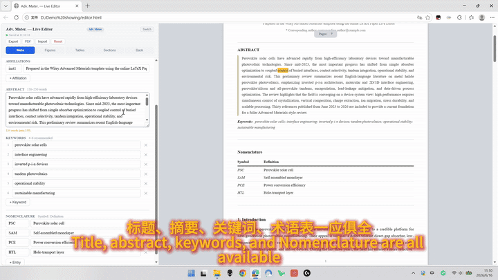
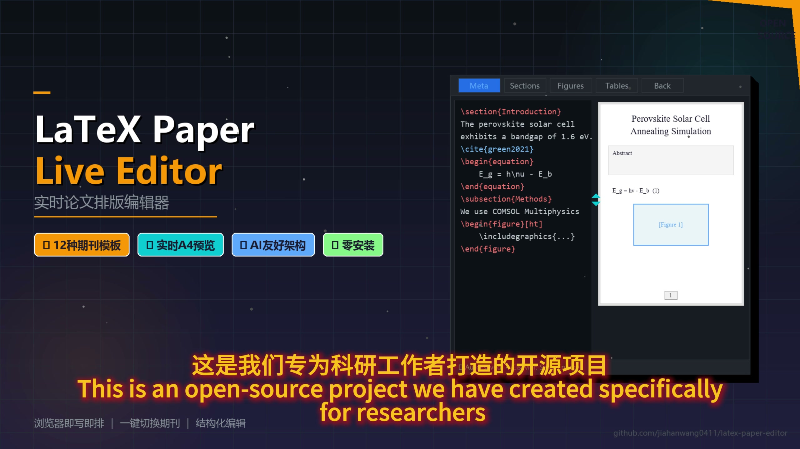

# LaTeX Paper Live Editor

[](https://jiahanwang0411.github.io/latex-paper-editor/)
[](#license)

<p align="center">
  
</p>

<p align="center">
  <a href="https://github.com/jiahanwang0411/latex-paper-editor/blob/main/assets/demo-full.mp4">
    
  </a>
  <br>
  <em>📹 点击观看完整项目介绍视频</em>
</p>

**AI + 实时排版，从初稿到可投稿 PDF 的一站式论文编辑器。**

本工具天然适配 **Codex、Claude Code、Kimi Work、QoderWork** 等 AI 编程工具的工作流：AI 生成的论文初稿通过 JSON 一键导入编辑器，自动按照目标期刊格式渲染排版，用户在所见即所得的双栏界面中精修内容，最终一键导出为可投稿的 A4 PDF。

> **定位说明**：本工具不是 LaTeX 编译器（如 Overleaf、TeX Live），而是一个所见即所得的排版预览编辑器。它让你在无需编写 LaTeX 源码的情况下实时预览论文排版效果，并通过内置的 PDF 导出功能直接生成可投稿文件。如需更精细的排版控制，也可将内容迁移到 Overleaf 等平台。

**在线体验 → [https://jiahanwang0411.github.io/latex-paper-editor/](https://jiahanwang0411.github.io/latex-paper-editor/)**

## 核心工作流

```
AI 生成初稿 → JSON 导入编辑器 → 选择期刊模板自动排版 → 人工精修 → 导出 PDF 投稿
```

这一工作流的关键在于：编辑器的数据格式（JSON）对 AI 工具极为友好。Codex、Claude Code 等 AI 可以直接生成符合编辑器数据结构的 JSON 文件，导入后内容立即按照所选期刊（Elsevier / Wiley / ACS 等）的格式规范渲染，省去了手动调整排版的繁琐步骤。

## 功能概览

**双栏实时预览** — 左侧结构化编辑面板 + 右侧 A4 比例分页预览，内容自动分页，段落跨页智能断行，KaTeX 数学公式实时渲染。

**12 种期刊模板** — 支持 Elsevier（elsarticle、Solar Energy、J. Power Sources、Applied Energy）、Wiley（Standard、Adv. Mater.、Angew. Chem.、Adv. Energy Mater.）、ACS（Standard、JACS、ACS Nano、ACS Energy Lett.），每种模板的字体、章节编号、摘要样式均按对应期刊 LaTeX 模板风格渲染，编辑器内随时切换。

**结构化编辑** — 五个标签页覆盖论文全部结构：Meta（标题/作者/摘要/关键词/术语表）、Figures（拖拽上传 + 一键复制 LaTeX 代码）、Tables（三线表可视化编辑）、Sections（15 个 LaTeX 快捷工具按钮）、Back（CRediT/声明/致谢）。

**光标同步与高亮** — 左侧光标移动时右侧预览自动跟随滚动，当前单词以黄色脉冲动画高亮，支持重复词精确定位。

**数据管理** — 自动保存到浏览器 localStorage，支持 JSON 导出/导入（这也是 AI 工作流的数据交换格式），一键重置为空白模板。

**PDF 导出** — 点击 PDF 按钮通过浏览器打印功能直接导出为标准 A4 PDF，文字可选中可搜索，无需额外工具。

## 为什么适合 AI 工作流

本项目采用**纯 HTML 单文件**架构（约 2100 行），这一设计带来了与 AI 编程工具协作的天然优势：

- **零构建**：不需要 `npm install` 或任何构建工具，AI 修改后刷新浏览器即见效果
- **单文件即完整应用**：所有 CSS、JS、HTML 内联，AI 只需理解一个文件就能添加功能或修复问题
- **数据结构透明**：JSON 格式的论文数据对 AI 完全可读可写，AI 可以直接生成结构化的论文内容并通过 Import 导入
- **轻松扩展模板**：添加新期刊模板只需一条配置 + 几行 CSS，AI 工具可以秒级完成

**典型场景**：让 AI 添加 Nature 模板、调整排版细节、修复渲染问题、扩展新功能（如参考文献管理器），AI 在单文件中增量修改即可。

## 使用说明

### 在线使用（推荐）

直接访问在线地址，无需安装：

👉 **[https://jiahanwang0411.github.io/latex-paper-editor/](https://jiahanwang0411.github.io/latex-paper-editor/)**

1. 首次打开进入模板选择界面，点击出版商卡片（Elsevier / Wiley / ACS），选择具体期刊子模板
2. 在左侧面板编辑论文内容，右侧实时预览排版效果
3. 数据自动保存在浏览器中，下次打开自动加载
4. 点击 **Switch** 按钮可随时切换期刊模板
5. 点击 **PDF** 按钮导出为标准 A4 PDF 文件

### 本地使用

下载 `index.html` 文件后双击用浏览器打开即可。唯一的外部依赖是 KaTeX 数学公式库（从 CDN 加载），需要网络。

```bash
# 方式一：直接双击 index.html 打开

# 方式二：使用本地服务器（推荐）
python -m http.server 8080   # 然后访问 http://localhost:8080
npx serve .                  # 然后访问 http://localhost:3000
```

跨设备迁移数据：使用 **Export** 导出 JSON，在另一台设备上 **Import** 导入。

### AI 工作流使用

1. 在 Codex / Claude Code / Kimi Work / QoderWork 中让 AI 生成论文内容
2. AI 输出符合编辑器结构的 JSON 文件（包含 title、abstract、sections 等字段）
3. 在编辑器中点击 **Import** 导入 JSON 文件
4. 内容自动按照所选期刊格式渲染，直接在编辑器中修改润色
5. 满意后点击 **PDF** 导出可投稿文件

## 支持的 LaTeX 语法

预览器支持渲染：编号公式 `\begin{equation}`（自动编号 + `\label` 引用）、多行公式 `\begin{align}`、行内/行间数学公式（KaTeX）、`\subsection{}`、`\begin{figure}`（含 `\includegraphics`）、`\begin{table}` 三线表（booktabs）、`\cite{}` → `[N]`、`\ref{}` → "Fig. N" / "Table N"、`\textbf{}` / `\textit{}` / `\emph{}`、`\todo{}`、`\noindent` / `\indenttwo{}`。

## 技术说明

纯前端单文件应用，无后端依赖。数学公式渲染依赖 [KaTeX](https://katex.org/) (cdnjs CDN)。数据持久化使用浏览器 localStorage。分页算法通过离屏测量 + 二分查找实现精确断页。模板切换通过 `body.tpl-*` CSS 类名 + `TEMPLATES` 配置对象实现。

## 贡献

欢迎提 Issue 反馈问题或提交 PR。

## License

MIT License
